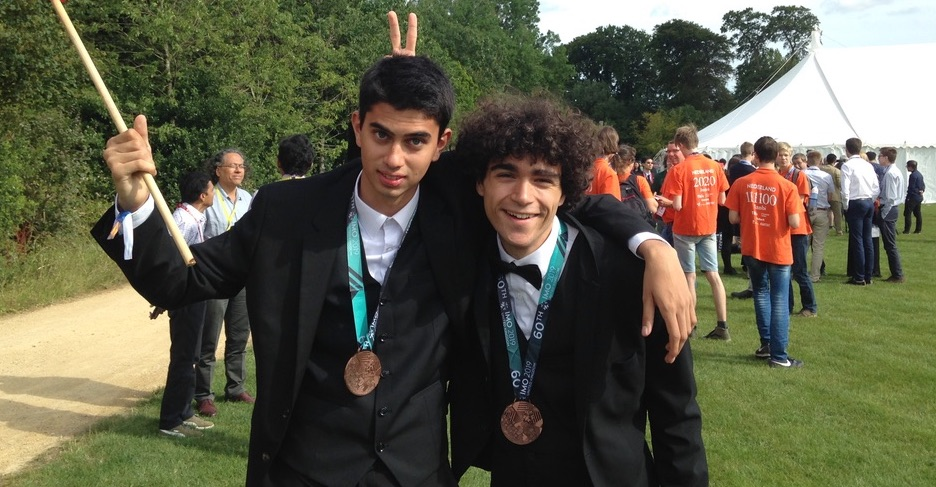

I grew up in Geneva, Switzerland, and fell deeply in love with mathematics while participating in many national and international [mathematics competitions](olympiad.html) during my high school years. I also took part in several extracurricular mathematical programs, and am an alumnus of the [Cours Euler](https://www.epfl.ch/education/education-and-science-outreach/fr/cours-euler/honneurs/) and [PROMYS Europe](https://promys-europe.org/) programmes. 

<figure>
    
    <figcaption>Figure 2: Almost Gold</figcaption>
</figure>

### Bachelor and Master's studies

I obtained a Bachelor's degree in Mathematics from EPF Lausanne and a Master's degree in Mathematics from ETH Zürich. 

I took part in a seminar on percolation at ETH Zürich, and completed two semester projects on vertex-critical graphs without critical edges and on Ramsey theory. I wrote my Bachelor's thesis under the supervision of Florian Karl Richter on van der Waerden's theorem, and my Master's thesis under the supervision of Vitaly Bergelson on topics in ergodic Ramsey theory. You can find all of these documents [here](research.html).

