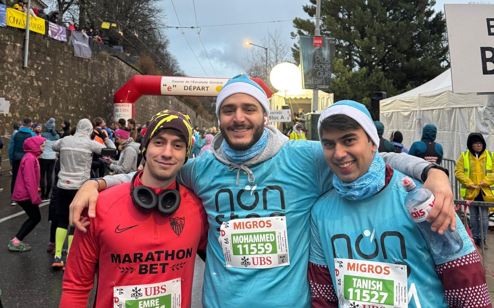
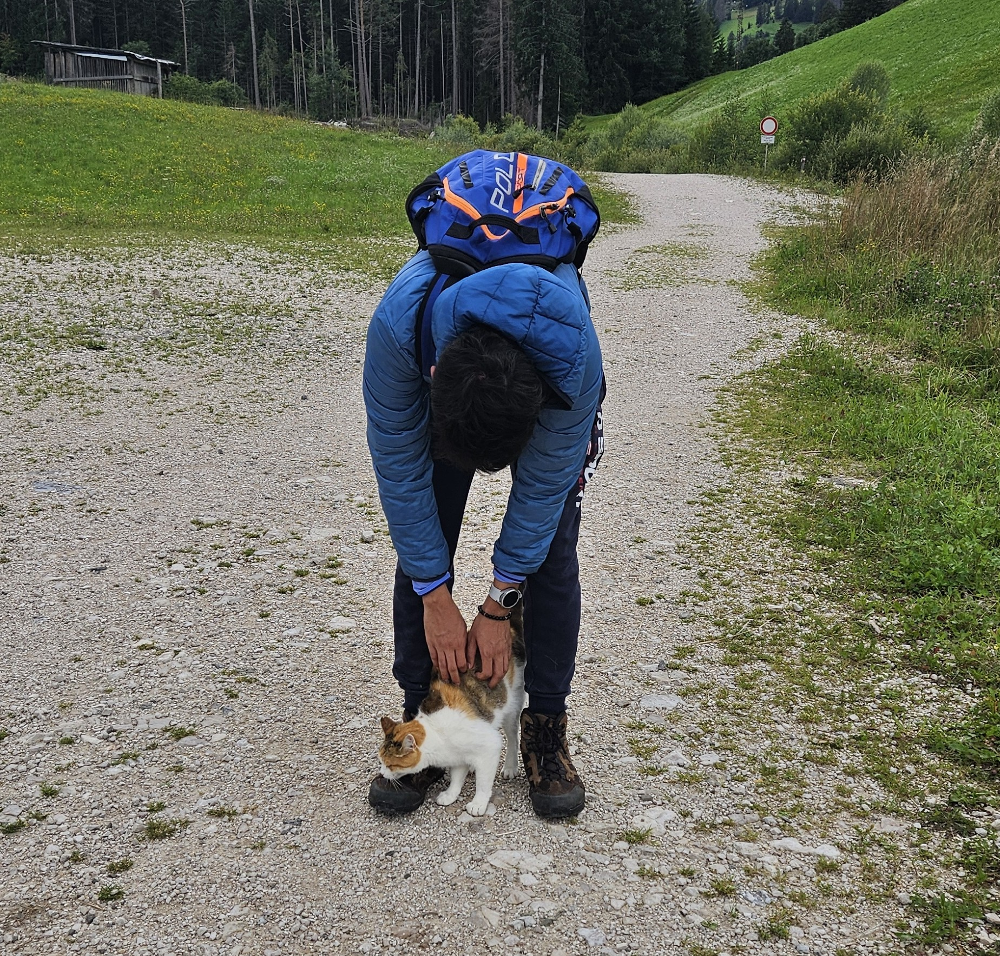
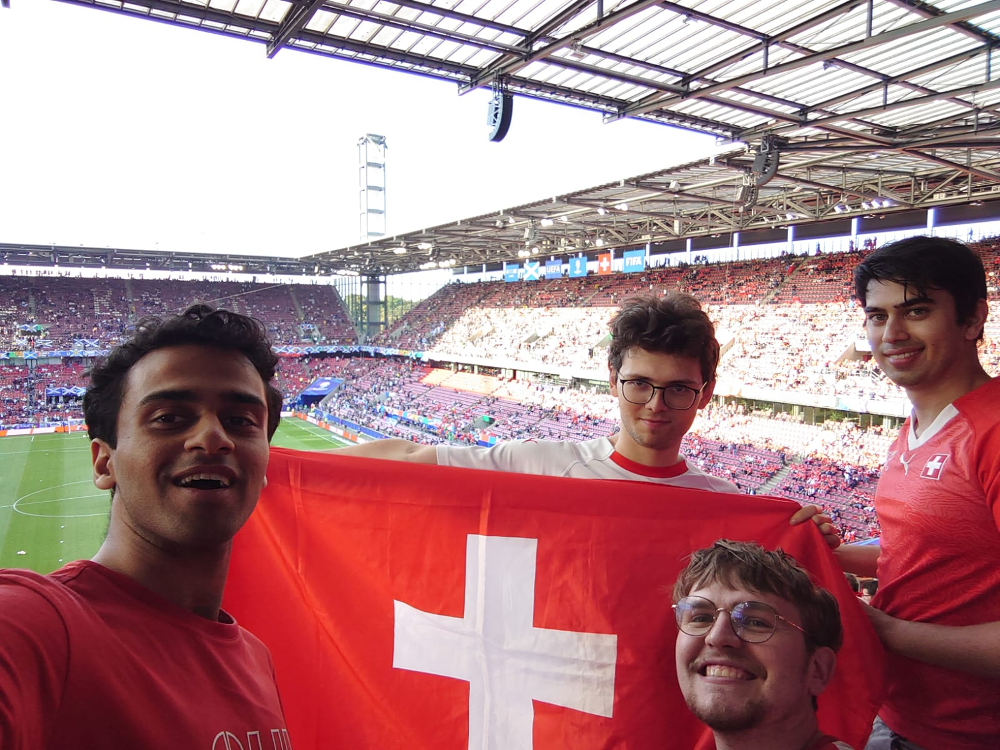
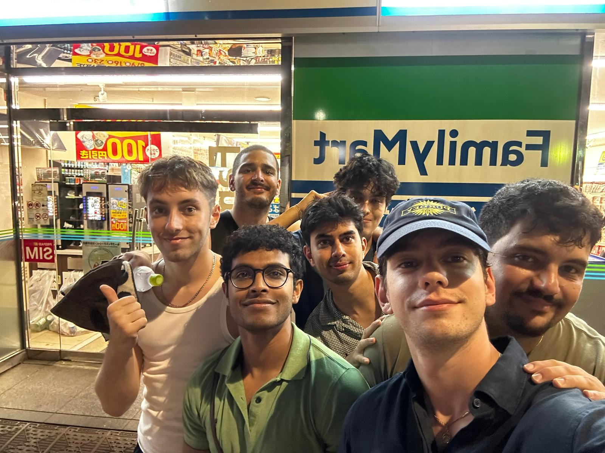
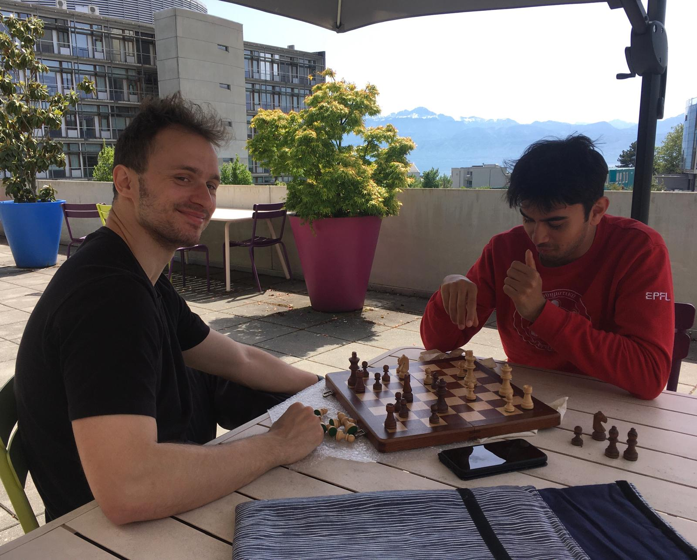

This website is named after my [favourite mathematics book](https://en.wikipedia.org/wiki/Proofs_from_THE_BOOK), which was conceived by my [favourite mathematician](https://en.wikipedia.org/wiki/Paul_Erd%C5%91s).

### Getting outdoors...

I quite enjoy hiking and running, and am quite mediocre at both. I have also had the privilege to travel quite a lot, both with friends and family and for mathematical competitions. 

<figure style="width: 80%; margin: auto;">
    

        
        
    

    <figcaption>Figure 6: The pinnacle of human athleticism</figcaption>
</figure>

I follow (and occasionally play) a lot of sports, but the three closest to my heart are football, basketball and cricket. I support Chelsea FC, BVB Dortmund, the Golden State Warriors and the Mumbai Indians (as well as the Swiss national football team and the Indian national cricket team). 

<figure>
    
    <figcaption>Figure 7: Hopp Schweiz!</figcaption>
</figure>

<figure>
    
    <figcaption>Figure 8: Lads on tour</figcaption>
</figure>

### ...and going indoors

I love video games and have sunk a considerable number of time into two games in particular, Mario Kart 8 Deluxe and Sid Meier's Civilization VI. I love both indie and puzzle video games as well. 

I am an amateur chess and poker player, with a rating of around 1800 on Lichess. I am very passionate about a card game called [Tichu](https://en.wikipedia.org/wiki/Tichu), which is quite big in mathematical olympiads in Europe.

<figure>
    
    <figcaption>Figure 9: In the spirit of Mikhail Tal</figcaption>
</figure>

I love trivia and have the bad habit of going down rabbit holes on Wikipedia for hours at a time. I enjoy board games, particularly involving social deduction. I also like to draw, and have [designed most of the Swiss IMO t-shirts of the past few years](/tshirts.html).

Despite what the name of this website might suggest, I am not a renowned chef, although I do enjoy cooking, especially Indian food. I learnt how to play the piano for five years but my musical abilities are comparable to my culinary skills. However, it did leave me with a deep appreciation for both jazz and Western classical music. I have a yellow belt in Karate, which puts me at par with most six-year-olds. 

I have a strange love for ranking things, and I maintain [lists of my favourite video games, books, films and more](/lists.html).

