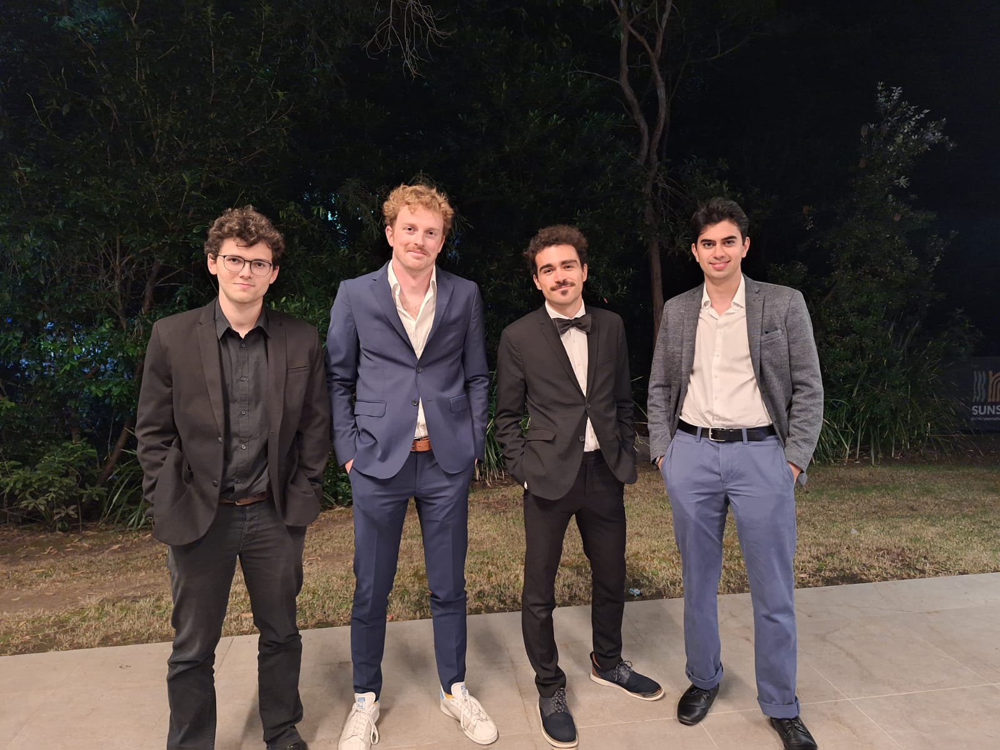
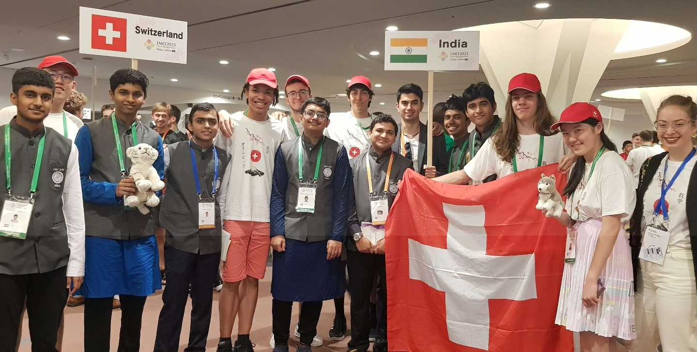

I am in charge of communications at the [Swiss Mathematical Olympiad](https://mathematical.olympiad.ch/en/),
an annual, national mathematics competition for high school students. The primary purpose of the competition is to select the Swiss delegation for the [International Mathematical Olympiad](https://www.imo-official.org/) (IMO)
and the [Middle European Mathematical Olympiad](https://www.memo-official.org/MEMO/contests/previous/) (MEMO).
We are part of a larger network of [Swiss Science Olympiads](https://science.olympiad.ch/en/). 

What do we do as volunteers? A multitude of things!

Our most important job is teaching Olympiad mathematics, which is quite different to the usual high-school curriculum, as it puts an emphasis on problems where both the statement and solution are easy to understand, but actually doing it yourself requires creativity and strong mathematicial intuition. It's also important that the proofs be [beautiful and satisfying](https://www.youtube.com/watch?v=M64HUIJFTZM).

We also have to narrow down the field of students to select Swiss teams. This means we have to invent original problems and check them for beauty and difficulty, create exams from our favourite problems, organize the various stages of the Olympiad throughout the year (including a few training camps), create markschemes and correct students' solutions, take the team to international competitions and bring them home safely again. It takes a village! 

Our problems, results and teaching material can be found on our [archive](https://imosuisse.github.io).

Some of my favourite activities at the SMO are test-solving the [incredible problems](https://valentin-imbach.github.io/portfolio.html) created by my friend and colleague Valentin, and teaching and creating [handouts](teaching.html) for our students. I also make some [original problems](/portfolio.html) of my own.

I run the Instagram meme page [swiss.mo](https://www.instagram.com/swiss.mo/). 

<figure>
    
    <figcaption>Figure 3: Always in good company at MOs</figcaption>
</figure>

### Roles at International Olympiads
I have had the great privilege of attending many, many Olympiads in a variety of roles: 

- **Coordinator** at MEMO 2026 (Slovenia), OFM 2026 (online), EGMO 2023 (Slovenia)
- **Problem Selection Committee** at MEMO 2026 (Slovenia), MEMO 2022 (Switzerland)
- **Deputy Leader for Switzerland** at IMO 2020 (online), IMO 2023 (Japan), IMO 2025 (Australia)
- **Team Leader for Switzerland** at OFM 2020 (online), OFM 2021 (online), CMC 2020 (online)
- **Team Guide** for EGOI 2021 (online)
- **Main Organiser** of GQMO 2020 (online)

I am on the organizing committee for IMO 2030, which will take place in Lausanne, Switzerland. 

<figure>
    
    <figcaption>Figure 4: A very merry Tanish Patil crossover</figcaption>
</figure>

### Awards

I have participated at a number of mathematical competitions. Some of my achievements include:

- **Bronze Medal** at IMO 2019 in England
- **Silver Medal** at the Swiss Mathematical Olympiad 2019
- **Honourable Mention** at IMO 2018 in Romania
- **Silver Medal** at BxMO 2018 in Luxembourg
- **Silver Medal** at the Swiss Mathematical Olympiad 2018
- **Honourable Mention** at IMO 2017 in Brazil
- **Silver Medal** at the Swiss Mathematical Olympiad 2017
- **Bronze Medal** at the Swiss Mathematical Olympiad 2016
- **Gold Medal** at UKMT JMO 2013
- **Silver Medal** at UKMT JMO 2012

I also participated at MEMO 2016.

A detailed breakdown of my performance at IMO can be found on
[imo-official](https://www.imo-official.org/results/contestant/27483/),
and my national achievements are found on
[my page](https://imosuisse.github.io/participants/tanish-patil) on the SMO archive and in the 
[Hall of Fame](https://imosuisse.github.io/hall-of-fame).

In 2017, the Swiss IMO team was awarded for **Best Swiss Team Achievement** for our performance.

I am currently the highest scoring Swiss Mathematical Olympiad contestant in the topic of Combinatorics.

